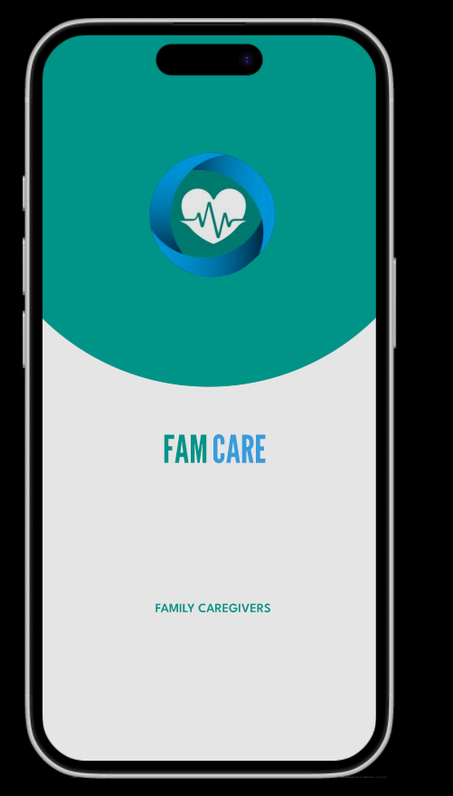

### Project Description:

The **FamCare** app is a family health management platform designed to simplify the coordination of caregiving tasks, medication schedules, and health records. The app utilizes **Flutter** for the frontend, **FastAPI** for the backend, **Firebase** for authentication and database management, and **Machine Learning algorithms** for predictive features, ensuring a seamless user experience for family health management.

### Setup Instructions:

To get started with FamCare, follow the detailed setup guide for creating the initial environment, including the implementation of the **splash screen** and **homepage**:

1. **[Setting up the Project Environment and Splash Screen](2-set-up-project-environment.md)**  
   This document covers the setup of the project environment, as well as the creation of the **splash screen** and **homepage**. It also includes the integration of **Flutter Riverpod** for state management, helping coordinate different screens based on user interactions.
   
   

This **README** serves as the main entry point for the FamCare project, linking to essential setup instructions and detailed steps for running and extending the app.
